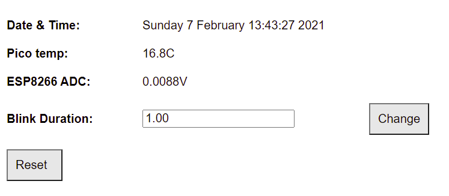

# PicoWebServer

This program runs on a Raspberry Pico RP2040 to provide a web server when connected to an Espressif ESP8266. This allows the Pico to be monitored and controlled from a browser. The Pico RTC can also be updated with the current time from NTP servers and the ESP8266 GPIOs can be accessed from the Pico. 

It was written as an exercise in learning the Pico SDK so is more complex than it needs to be. The web server runs on Core 1 and the example runs on Core 0. FIFOs and interrupts are used to communicate between the cores, and mutexes used for coordination. The Pico and ESP8266 communicate over a UART serial connection. Logging is output over the Pico USB.

The program consists of:
* `PicoWebServer.cpp`
* `PicoWebServer.h`
* `blinkLed.pio` (optional, used for learning about PIOs)

## ESP8266
The ESP8266 provides wifi connectivity for the Raspberry Pico. The ESP8266 needs to be loaded with Espressif AT firmware after which no programming of the ESP8266 is required. The AT firmware resources can be downloaded from Espressif:
* [AT firmware](https://docs.espressif.com/projects/esp-at/en/latest/AT_Binary_Lists/ESP8266_AT_binaries.html). Note `ESP8266 NonOS AT Bin` is no longer available and has been replaced by `ESP8266 IDF AT Bin` which I have not tested. A copy of the old firmware is stored in this repository: `ESP8266_NonOS_AT_Bin_V1.7.4.zip`
* [Flashing tool](https://www.espressif.com/sites/default/files/tools/flash_download_tool_v3.8.5.zip).
* [Instructions](https://www.espressif.com/sites/default/files/documentation/4a-esp8266_at_instruction_set_en.pdf).

## Connection Pins

Pico  | ESP8266 |
------------ | ------------- |
0 (TX) | 3 (RX) |
1 (RX) | 1 (TX) | 
2 | RST |
GND  | GND | 

The ESP8266 can be powered from the Pico, or a separate power source can be used but retaining the common GND connection. Pico pin 2 is used to reset the ESP8266.

## Configuration

Requires the [Pico SDK](https://datasheets.raspberrypi.org/pico/getting-started-with-pico.pdf) and appropriate toolchain. 

The following user configuration must be completed in the `PicoWebServer.h` file:  
  
`#define WIFISSID "****" // wifi SSID`  
`#define WIFIPASS "****" // wifi password`  
`#define STATICIP "192.168.1.135" // static IP for PicoWebServer`  
`#define GATEWAY "192.168.1.1" // gateway IP (eg router)`  
`#define TIMEZOME 0 // +/- local time offset in hours from UTC`  

## Example

The files `PicoWSexample.cpp` and `PicoWSpage.h` provide an example of using the PicoWebServer to display the following content on a browser. The web page refreshes every 10 seconds using AJAX and JSON: 

